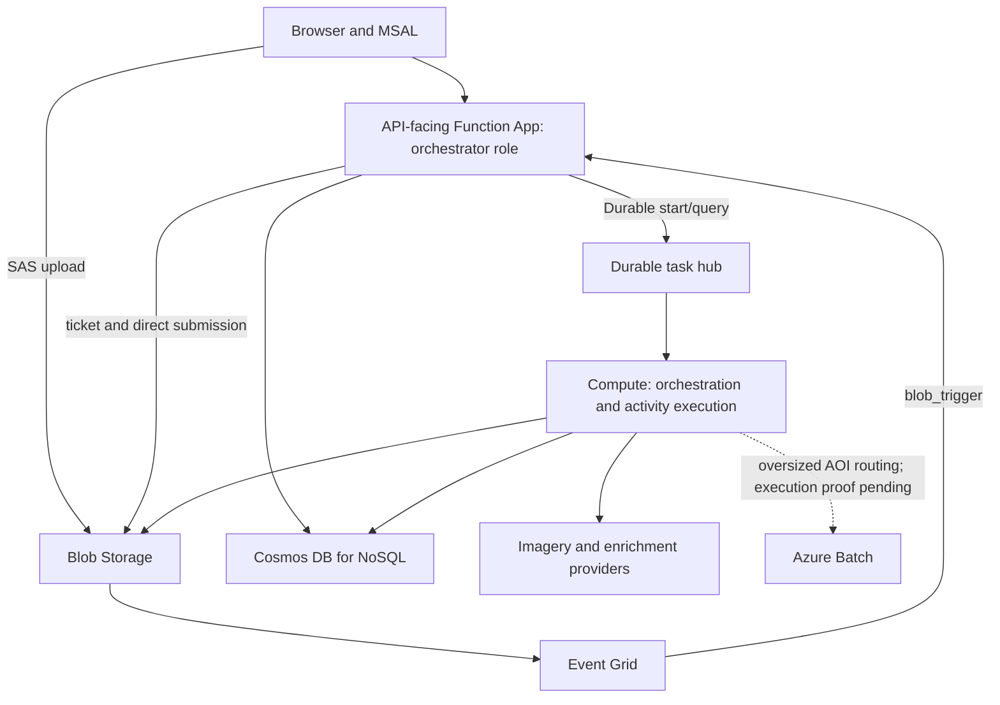

# Architecture Overview

Canonical technical responsibility map, reviewed 2026-09-16. Describes checked-in
behavior and explicitly approved targets; it does not certify a live deployment.

## Document Authority

| Concern | Authority |
| --- | --- |
| Service boundaries and architectural decisions | This document and [ADRs](adr) |
| Entities, identity, ownership and persistence | [Data model](DATA_MODEL.md) |
| HTTP shapes, methods and authentication | [OpenAPI](openapi.yaml), explained by [API reference](API_INTERFACE_REFERENCE.md) |
| Activity and blob contracts | [API reference](API_INTERFACE_REFERENCE.md) |
| AOI metadata and enrichment formats | [Schemas](schemas), [enrichment contract](ENRICHMENT_AOI_MODEL.md) |
| Setup, verification, deployment and recovery | [Operations runbook](OPERATIONS_RUNBOOK.md) |
| Direction and planned delivery | [Roadmap](ROADMAP.md) and linked issues |

The [PID](PID.md) records product requirements, not shipped behavior. Persona
research and archived reviews are context, not runtime contracts. Superseded
system/topology/rollout documents redirect here rather than duplicate definitions.
Change the owning contract and its regression tests together. Architecture changes
require an explicit decision; neither a code change nor an old proposal approves itself.

## Approved Target

Owner decisions, 2026-09-16:

- Retain the Azure-integrated engine. A cloud-independent pipeline or repository
  split is not a goal; pure geospatial transforms remain useful within it.
- A lightweight API/admission service accepts requests and buffers work durably.
  Independent workers execute processing. Workers retain operational probes, not
  the full user API. The current shared HTTP registration requires migration (#1526).
- Prefer scale-to-zero where wake-up latency is acceptable. If admission must stay
  warm, keep it low-cost; expensive workers should sleep when idle. Cost should
  follow usage. Containers and VM/Batch capacity are workload-dependent options.
- Require authenticated, authorized run diagnostics before leaving local
  development. This requirement is not yet implemented (#1527).

No latency SLO, warm-instance budget, WASM hosting choice or KEDA configuration was
approved by this audit. Select these from measured admission/wake-up behavior,
queue safety, idle cost and representative workloads, not diagram assumptions.
The bounded measurement brief is #1528; it does not authorize cloud spend or
select a hosting implementation.

## Current Runtime

The name `orchestrator` refers to the API-facing app, not where Durable
orchestration functions currently execute. With `PIPELINE_ROLE=orchestrator`,
[pipeline registration](../blueprints/pipeline/__init__.py) omits activities and
both orchestration listeners. `PIPELINE_ROLE=full` loads them on compute.
[Shared registration](../function_registration.py) currently registers HTTP
blueprints on both roles and the monitoring scheduler on compute only.

Browsers use the API-facing hostname from `/api-config.json`, obtained operationally
with `tofu output -raw function_app_orch_default_hostname`. SWA serves static files;
CIAM/MSAL supplies bearer tokens verified by protected backend routes. Current
diagnostics are anonymous by instance ID. Registration, intended browser ingress
and actual network access are different facts: compute isolation must be verified.

Cosmos stores application records; Blob Storage holds uploaded source, claims,
manifests and raster artifacts. Durable owns execution history and work queues.
Cosmos is not a substitute queue and should not duplicate Durable execution state
as a second coordinator. See the data model for authoritative records, partition
keys, fallbacks and single-document transaction limits. Serverless request-based
billing does not eliminate storage charges or prove total idle cost is zero.

## Pipeline and Verification

Submission `202` means ticket/source persistence, not Durable admission. Event Grid
starts API-managed runs using submission identity and an admission marker. Metadata
is written during ingestion. Single-AOI acquisition/fulfilment runs directly;
multi-AOI work fans out into `aoi_pipeline` children before enrichment and fan-in.

| Responsibility | Owning implementation | Focused tests |
| --- | --- | --- |
| Submission and admission | [submission](../blueprints/pipeline/submission.py), [blob trigger](../blueprints/pipeline/blob_trigger.py) | [submission endpoints](../tests/test_analysis_submission_endpoints.py) |
| Parse, geometry, metadata and claims | [ingestion phase](../blueprints/pipeline/_phase_ingestion.py) | [ingestion tests](../tests/test_ingestion.py) |
| Acquisition and Durable waiting | [acquisition phase](../blueprints/pipeline/_phase_acquisition.py) | [acquisition tests](../tests/test_acquisition.py), [phase tests](../tests/test_orchestrator_phases_extra_coverage.py) |
| Download/post-processing and Batch routing | [fulfilment phase](../blueprints/pipeline/_phase_fulfilment.py) | [fulfilment tests](../tests/test_fulfilment.py) |
| Per-AOI evidence and manifest | [enrichment phase](../blueprints/pipeline/_phase_enrichment.py) | [enrichment tests](../tests/test_enrichment_runner.py), [schema tests](../tests/test_records.py) |
| Result identity and honest completion | [orchestrator](../blueprints/pipeline/orchestrator.py), [aggregation](../blueprints/pipeline/_aggregation.py) | [success guards](../tests/test_pipeline_success_guards.py) |
| Host roles | [registration](../function_registration.py) | [split tests](../tests/test_orchestrator_split.py) |
| Documentation contracts | [API reference](API_INTERFACE_REFERENCE.md) | [drift tests](../tests/test_docs_route_drift.py) |

Acquisition calls single-shot `check_order_status` activities and waits using
Durable timers. Activity retry is not whole-AOI replay. Failed child aggregation
preserves cause/status; parent failure does not imply siblings stopped. Output
`completed` and Durable `Completed` are different contracts; neither certifies
scientific validity, complete enrichment or legal compliance.

The Batch path is not accepted capacity: the advertised module command exits
successfully without executing fulfilment (#1522). Registration and a task exit
status do not prove a working CLI, provisioned pool or real artifacts. Verification must
exercise the worker command and artifact identities. Local synthetic pipeline
tests, live-provider science checks, browser workflows and scale experiments
answer different questions; the runbook owns the command/evidence matrix.

## Repository Ownership and Retention

| Surface | Purpose and disposition |
| --- | --- |
| `treesight/`, `blueprints/`, root entrypoints | Application and Azure-integrated processing; keep, review module responsibilities locally |
| `rust/`, `typings/` | Native kernels, dependency type boundaries; keep source/locks/stubs, ignore build output |
| `website/` | Static product and shared JS; retained conservation surface is not current growth scope |
| `tests/` | Behavior/configuration tests and fixtures; retain until consumer and redundancy checks justify removal |
| `scripts/`, `.github/`, `infra/`, Dockerfiles | Build/verify/operate; standalone scripts require callers or documented operator use |
| `docs/` | Owning contracts, requirements and decision history; avoid additional overlapping overviews |

No source/fixture is approved for deletion solely because no Python import was
found. Account for Function bindings, CLI calls, browser assets, native calls and
workflow references. Existing local user changes and untracked logging configuration
are not audit-generated rubbish.

Rebuildable caches: `.pytest_cache`, `.ruff_cache`, coverage and `rust/target`.
Reinstallable tools/environments: `.venv`, `.tools`, OpenTofu provider cache.
Preserve secrets, state, storage volumes and diagnostic evidence pending explicit
review. `make clean` deletes project data/models; it is not cache cleanup. Do not
use global Docker pruning. Historical docs remain evidence, not live policy;
duplicate current-state descriptions should be replaced with owning references.
