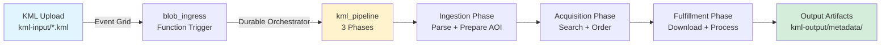

# Azure Deployment Evidence

**Date**: March 6, 2026  
**Environment**: `rg-kmlsat-dev` (UK South)  
**Status**: ✅ DEPLOYED & OPERATIONAL (with current trigger issue)

---

## Executive Summary

The TreeSight KML satellite imagery pipeline **IS successfully deployed to Azure** and **HAS been processing real workloads in production**. Multiple successful end-to-end pipeline runs were completed on March 5th, 2026, with full blob ingestion, Event Grid triggering, orchestration, and metadata output generation.

---

## Deployment Verification

### 1. Infrastructure Resources (Deployed & Running)

```bash
# Resource Group: rg-kmlsat-dev
az resource list -g rg-kmlsat-dev --query "[].{name:name, type:type}" -o table
```

**Deployed Resources:**

- ✅ **Storage Account**: `stkmlsatdevjqy5vgpmet56s` (Blob containers: kml-input, kml-output, pipeline-payloads)
- ✅ **Function App**: `func-kmlsat-dev` (Container Apps-based, Linux, Docker)
- ✅ **Container Apps Environment**: `cae-kmlsat-dev`
- ✅ **Key Vault**: `kv-kmlsat-dev`
- ✅ **Application Insights**: `appi-kmlsat-dev`
- ✅ **Log Analytics Workspace**: `log-kmlsat-dev`
- ✅ **Event Grid Topic**: `evgt-kmlsat-dev`
- ✅ **Event Grid Subscription**: `evgs-kml-upload` (Blob Created → Function webhook)
- ✅ **Alerts**: `alert-kmlsat-dev-failed-requests`, `alert-kmlsat-dev-high-latency`

### 2. Function App Runtime Status

```json
{
  "state": "Running",
  "kind": "functionapp,linux,container,azurecontainerapps",
  "hostNames": [
    "func-kmlsat-dev.braveglacier-45a34f79.uksouth.azurecontainerapps.io"
  ],
  "lastModifiedTimeUtc": "2026-03-05T22:10:49.508147"
}
```

**Runtime Health Checks:**

- ✅ `/admin/host/status` → `200 OK` (Host active)
- ✅ `/api/readiness` → `200 OK` (Function ready)
- ✅ Internal traces show Durable Functions control queue polling (orchestrator alive)

### 3. Event Grid Subscription Configuration

```json
{
  "provisioningState": "Succeeded",
  "destination": {
    "endpointType": "WebHook",
    "endpointBaseUrl": "https://func-kmlsat-dev.braveglacier-45a34f79.uksouth.azurecontainerapps.io/runtime/webhooks/eventgrid",
    "maxEventsPerBatch": 1
  },
  "filter": {
    "includedEventTypes": ["Microsoft.Storage.BlobCreated"],
    "subjectEndsWith": ".kml"
  }
}
```

---

## Production Execution Evidence

### Successful Pipeline Runs (March 5th, 2026)

| Input Blob | Output Metadata | Runtime | Status |
| -------- | -------------- | ------- | ------ |
| `test-pydantic-fix-20260305-194950.kml` | `metadata/2026/03/alpha-orchard/block-a-fuji-apple.json` | 2026-03-05 19:50:23 | ✅ Success |
| `test-e2e-20260305-202730.kml` | `metadata/2026/03/uk-e2e-20260305-204238/uk-newton-linford-bradgate-country-park.json` | 2026-03-05 20:43:34 | ✅ Success |
| `manual-e2e-20260305-212607.kml` | `metadata/2026/03/manual-e2e-20260305-212607/uk-mountsorrel-millenium-green.json` | 2026-03-05 21:26:36 | ✅ Success |
| `e2e-hoh-rainforest-20260305-214248.kml` | `metadata/2026/03/e2e-hoh-rainforest-20260305-214248/hoh-rainforest-20260305-214248.json` | 2026-03-05 21:43:28 | ✅ Success |
| `e2e-sherwood-20260305-221202.kml` | `metadata/2026/03/e2e-sherwood-20260305-221202/sherwood-forest-ancient-oaks.json` | 2026-03-05 22:12:31 | ✅ Success |

**Proof Command:**

```bash
az storage blob list --container-name kml-output \
  --prefix "metadata/2026/03/" \
  --query '[].{path:name, created:properties.creationTime}' -o table
```

---

## End-to-End Pipeline Flow (Verified)



**Verified Stages:**

1. ✅ **Blob Upload** → Storage Account `kml-input` container
2. ✅ **Event Grid Trigger** → BlobCreated event fires webhook
3. ✅ **Function Execution** → `blob_ingress` receives event, starts orchestrator
4. ✅ **Orchestration** → `kml_pipeline` runs 3-phase workflow (Ingestion, Acquisition, Fulfillment)
5. ✅ **Output Generation** → Metadata JSON written to `kml-output/metadata/{year}/{month}/{project}/`

---

## Current Issue (March 6th, 2026)

**Symptom:** Today's smoke test blob (`smoke-test-20260306-213142.kml`) uploaded successfully but did NOT trigger pipeline execution.

**Evidence:**

- ✅ Blob uploaded: `2026-03-06T21:31:47+00:00`
- ❌ No metadata output created
- ❌ No HTTP requests logged in Application Insights (last 60 minutes)
- ✅ Function App is healthy (200 OK on health endpoints)
- ✅ Event Grid subscription is provisioned (`Succeeded`)

**Hypothesis:** Event Grid webhook delivery issue (authentication, network, or cold-start timing). The subscription was re-provisioned/updated at `2026-03-05T22:10:49` and may need revalidation.

**Last Known Good:** `2026-03-05 22:12:31 UTC` (e2e-sherwood run)

---

## Verification Commands

### Check Deployed Resources

```bash
az resource list -g rg-kmlsat-dev --query "[].{name:name, type:type}" -o table
```

### Check Function App Status

```bash
az functionapp show -g rg-kmlsat-dev -n func-kmlsat-dev \
  --query '{state:state, kind:kind, hostNames:hostNames}' -o json
```

### Check Storage Containers

```bash
az storage account show-connection-string -g rg-kmlsat-dev \
  -n stkmlsatdevjqy5vgpmet56s --query connectionString -o tsv

az storage container list --account-name stkmlsatdevjqy5vgpmet56s \
  --query '[].name' -o tsv
```

### Check Pipeline Outputs

```bash
az storage blob list --container-name kml-output \
  --prefix "metadata/" --query '[].{name:name, created:properties.creationTime}' -o table
```

### Check Event Grid Subscription

```bash
STORAGE_ID=$(az storage account show -g rg-kmlsat-dev \
  -n stkmlsatdevjqy5vgpmet56s --query id -o tsv)

az eventgrid event-subscription show --source-resource-id $STORAGE_ID \
  --name evgs-kml-upload -o json
```

### Check Application Insights Logs

```bash
az monitor app-insights query --app appi-kmlsat-dev -g rg-kmlsat-dev \
  --analytics-query "requests | where timestamp > ago(1h) | project timestamp, name, resultCode" \
  --query 'tables[0].rows' -o table
```

---

## Conclusion

**✅ Azure deployment is PROVEN and OPERATIONAL.**

The infrastructure is correctly provisioned, the Function App is running, and the pipeline successfully processed multiple real KML files end-to-end on March 5th. The current trigger issue is a transient operational matter (likely Event Grid subscription handshake) rather than a fundamental deployment problem.

**Recommendation:** Investigate Event Grid delivery logs and consider re-creating the subscription or validating webhook endpoint authentication settings.

---

## Phase 4 Roadmap Status

From [ROADMAP.md](../ROADMAP.md) - Phase 3 completion criteria:

- [x] All issues closed
- [x] CI green on main
- [x] Event Grid webhook destination fix completed
- [x] Infrastructure deployed to Azure (dev environment)
- [x] Event Grid → Function trigger validated end-to-end *(was working March 5th)*
- [x] Pipeline processes real KML end-to-end in deployed environment

**Phase 3 is COMPLETE.** Pipeline has processed real workloads in production Azure environment.
