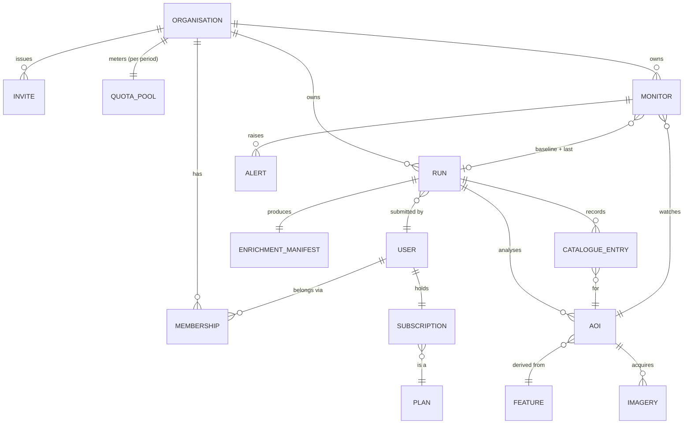

# Canopex Data Model

**Status:** Living document · Last reviewed 2026-07-09

This document describes the Canopex domain in three layers:

1. **[Conceptual model](#1-conceptual-model)** — the entities and their
   relationships in plain business language. No attributes, no storage.
2. **[Logical model](#2-logical-model)** — each entity's attributes, keys,
   and cardinality. Storage-agnostic.
3. **[Physical model](#3-physical-model)** — how the logical model is
   actually persisted today (Cosmos containers, partition keys, blob
   layout).

> **How to read this document.** Layers 1 and 2 describe the **intended
> domain** — the truth we are building toward. Layer 3 describes the
> **code as it exists today**. Where the two disagree, see
> [§4 Known divergences](#4-known-divergences). These gaps are
> deliberate and tracked, not accidental — do not "fix" the docs to match
> the code or vice versa without checking §4 first.

Related canonical docs:

- [SYSTEM_SPEC.md](SYSTEM_SPEC.md) §2 — domain model of the geometric /
  pipeline types (Feature, AOI, pipeline outcomes). This document is the
  higher-level companion covering ownership, billing, and persistence.
- [API_INTERFACE_REFERENCE.md](API_INTERFACE_REFERENCE.md) and
  [openapi.yaml](openapi.yaml) — the public request/response contracts.
- [schemas/aoi-metadata-v2.schema.json](schemas/aoi-metadata-v2.schema.json)
  — the formal contract for per-AOI metadata blobs.

---

## 1. Conceptual model

### 1.1 The one-paragraph domain

An **Organisation** is the unit of ownership, billing, and quota. **Users**
belong to one or more Organisations through a **Membership**. Each User
carries their own **Subscription** (a plan tier); an Organisation's usage
allowance is the *sum of its members' plan allowances*, so adding a member
increases the shared pool. When a member submits work, a **Run** analyses
one or more **AOIs** (Areas of Interest) parsed from an uploaded KML/KMZ
**Feature** set. Each Run draws down the Organisation's **Quota Pool** for
the current period. A Run acquires satellite **Imagery** per AOI, produces
an **Enrichment Manifest** (NDVI, change detection, weather), and records
one **Catalogue Entry** per AOI so history is queryable over time. A
**Monitor** can re-run analysis for a single AOI on a schedule and raise an
**Alert** when change thresholds are breached.

### 1.2 Entities

| Entity | What it is |
|--------|------------|
| **Organisation** | The owner of all work, billing, and quota. The tenant boundary. |
| **User** | An authenticated person, identified by their CIAM identity. |
| **Membership** | The link between a User and an Organisation, carrying a role (owner / member). |
| **Invite** | A pending, tokenised offer for an email address to join an Organisation. |
| **Subscription** | A User's billing plan (tier), optionally linked to Stripe. |
| **Plan** | A tier definition (limits and capabilities). Reference data, not per-user. |
| **Quota Pool** | An Organisation's parcel allowance and consumption for one billing period. |
| **Run** | One pipeline execution: analyses a submitted set of AOIs. |
| **Feature** | A polygon parsed from an uploaded KML/KMZ, before geometry processing. |
| **AOI** | An Area of Interest: a Feature with computed geometry (area, bbox, buffer, centroid). |
| **Imagery / Scene** | A satellite scene acquired for an AOI (search result → order → download → post-process). |
| **Enrichment Manifest** | The analysis payload for a Run: NDVI stats, change detection, weather, frames. |
| **Catalogue Entry** | A durable per-AOI record of one Run's acquisition + results, for historical query. |
| **Monitor** | A scheduled re-analysis subscription for a single AOI with a baseline. |
| **Alert** | A threshold breach raised by a Monitor. |

### 1.3 Relationships



**Cardinality notes (intended):**

- **User ⇄ Organisation is many-to-many**, expressed through Membership.
  A User may belong to more than one Organisation.
- **Organisation owns Runs, AOIs, Catalogue Entries, and Monitors.**
  Ownership is organisational, not personal. A Run also records *which
  member* submitted it, but the owner is the Organisation.
- **Quota is org-pooled.** `pool = Σ (each member's plan run_limit)`.
  A Run reserves parcels from the pool; adding a member raises the pool.
- **Subscription is per-User.** Each member's own tier contributes its
  `run_limit` to every Organisation they belong to.

> Two of these relationships are **not yet reflected in the code** — see
> [§4](#4-known-divergences) before relying on them.

---

## 2. Logical model

Attributes, keys, and cardinality, independent of storage. Types are the
domain types, not the wire/JSON representation. Fields marked *(open)* are
flexible/extensible bags whose inner shape is not fully typed today.

### 2.1 Ownership & identity

#### Organisation

| Attribute | Type | Notes |
|-----------|------|-------|
| `org_id` | string | **Identity.** |
| `name` | string | Display name. |
| `created_by` | string (user_id) | Founding user. |
| `created_at` | timestamp | |
| `members` | list\<Membership\> | Embedded (see below). |
| `billing` | object *(open)* | Stripe linkage, EUDR status, period counters. |
| `quota_pool` | Quota Pool | Current-period usage (see §2.3). |

#### User

| Attribute | Type | Notes |
|-----------|------|-------|
| `user_id` | string | **Identity.** Derived from CIAM `tid:oid`, never email. |
| `email` | string | |
| `display_name` | string | |
| `identity_provider` | string | |
| `billing_allowed` | boolean | Operator override for billing eligibility. |
| `assigned_tier` | string \| null | Operator tier override. |
| `first_seen` / `last_seen` / `created_at` / `last_modified` | timestamp | Lifecycle. |
| `memberships` | list\<Membership\> | **Intended M:N** (see §4). |

#### Membership

| Attribute | Type | Notes |
|-----------|------|-------|
| `user_id` | string | The member. |
| `org_id` | string | The organisation. |
| `email` | string | Denormalised for display. |
| `role` | enum `owner` \| `member` | |
| `joined_at` | timestamp | |

#### Invite

| Attribute | Type | Notes |
|-----------|------|-------|
| `org_id` | string | Target organisation. |
| `email` | string | Invitee. |
| `token` | string (signed JWT) | 7-day TTL. |
| `status` | enum `pending` \| `accepted` \| `revoked` \| `expired` | |
| `invited_by` / `invited_at` / `expires_at` | audit | |
| `accepted_at` / `accepted_by` | audit | Set on acceptance. |
| `email_sent_at` / `email_resent_count` | audit | Delivery tracking. |

### 2.2 Billing

#### Subscription (per User)

| Attribute | Type | Notes |
|-----------|------|-------|
| `user_id` | string | **Identity.** |
| `tier` | enum (see Plan) | `free` \| `demo` \| `starter` \| `pro` \| `team` \| `enterprise` \| `eudr_pro`. |
| `status` | string | e.g. `active`, `none`. |
| `stripe_customer_id` | string \| null | Post-webhook. |
| `stripe_subscription_id` | string \| null | Post-webhook. |
| `updated_at` | timestamp \| null | |

#### Plan (reference data)

Defined in `PLAN_CATALOG` ([treesight/security/billing.py](../treesight/security/billing.py)).
One entry per tier. Attributes: `label`, `run_limit`, `aoi_limit`,
`concurrency`, `ai_insights`, `api_access`, `export`, `retention_days`,
`temporal_cadence`, `max_history_years`, `overage_rate`.

### 2.3 Quota Pool (per Organisation, per period)

The single source of truth for "how many parcels has this org consumed
this period" ([treesight/billing/accounting.py](../treesight/billing/accounting.py)).

| Attribute | Type | Notes |
|-----------|------|-------|
| `period_start` / `period_end` | timestamp | Calendar month, UTC. |
| `allowance` | int (computed) | `Σ` each member's plan `run_limit`. Not stored — computed from members. |
| `runs_reserved` | int | Parcels debited at submit time. |
| `runs_completed` | int | Reservations finalised as success. |
| `runs_refunded` | int | Reservations finalised as failure. |
| `reservations` | map\<instance_id, Reservation\> | In-flight/settled reservations. |
| `finalized_instance_ids` | list\<string\> | Idempotency guard for finalize. |
| `member_used` | map\<user_id, int\> | Persistent per-member consumption for member caps. |

**Rules (from code):**

- **1 run = 1 parcel processed.** EUDR is a *flag* on the run, not a
  separate counter.
- **Two-phase, idempotent.** `reserve_run(instance_id)` debits the pool;
  `finalize_run(instance_id, status)` moves it to completed or refunded.
  Both keyed on the orchestrator `instance_id`.
- **ETag optimistic concurrency**, up to `MAX_ETAG_RETRIES` (5).
- Rejections surface as typed errors: `OrgNotFoundError`,
  `QuotaExhaustedError`, `MemberCapExceededError`, `ConcurrencyError`.

#### Reservation (transient receipt)

Returned by `reserve_run`: `org_id`, `user_id`, `instance_id`,
`parcel_count`, `is_eudr`, `period_start`, `period_end`, `pool_remaining`.

### 2.4 Analysis work

#### Run

The record of one pipeline execution.

| Attribute | Type | Notes |
|-----------|------|-------|
| `submission_id` | string | Client-supplied submission id. |
| `instance_id` | string | **Identity.** Durable orchestrator instance. |
| `owner` | Organisation | **Intended** owner (see §4 — code stores `user_id`). |
| `submitted_by` | User | Submitting member. |
| `submitted_at` | timestamp | |
| `status` | string | `submitted` → … → terminal. |
| `eudr_mode` | boolean | |
| Source | `kml_blob_name`, `kml_size_bytes`, `submission_prefix`, `provider_name` | |
| Preflight context | `feature_count`, `aoi_count`, `max_spread_km`, `total_area_ha`, `largest_area_ha`, `processing_mode`, `workspace_role`, `workspace_preference` | |
| Timing | `started_at`, `completed_at`, `duration_seconds` | |
| Billing ledger | `tier_at_submission`, `billing_type` (`included`\|`overage`\|`free`\|`demo`), `overage_unit_price`, `billing_status` (`pending`\|`charged`\|`refunded`), `payment_ref`, `refund_reason` | |
| Resource cost | `resource_summary` *(open)*, `estimated_cost_pence`, `wasted_cost_pence` | |

#### Feature (transient — parsed input)

A polygon extracted from KML/KMZ before geometry processing.
See [SYSTEM_SPEC.md](SYSTEM_SPEC.md) §2 and
[treesight/models/feature.py](../treesight/models/feature.py).
Key attributes: `name`, `exterior_coords`, `interior_coords`, `crs`,
`source_file`, `feature_index`, computed `dedup_key`.

#### AOI (transient — processed geometry)

A Feature with computed geometry.
[treesight/models/aoi.py](../treesight/models/aoi.py).
Key attributes: `feature_name`, `bbox`, `buffered_bbox`, `area_ha`
(geodesic), `perimeter_km`, `centroid`, `buffer_m` (default 100 m),
`area_warning`, computed `dedup_key`. Persisted as an AOI-metadata blob
(schema v2), not a Cosmos row.

#### Imagery / Scene (transient — pipeline outcomes)

A scene as it moves search → order → download → post-process. Modelled by
`SearchResult`, `ImageryOutcome`, `DownloadResult`, `PostProcessResult`
([treesight/models/imagery.py](../treesight/models/imagery.py),
[outcomes.py](../treesight/models/outcomes.py)). Aggregated into
`PipelineSummary`. See [SYSTEM_SPEC.md](SYSTEM_SPEC.md) §3 for the full
per-phase shapes.

#### Enrichment Manifest (per Run)

The `timelapse_payload.json` analysis payload.
[treesight/models/records.py](../treesight/models/records.py) →
`EnrichmentManifest`.

| Attribute | Type | Notes |
|-----------|------|-------|
| `coords` / `bbox` / `center` | geometry | Required core. |
| `frame_plan` | list\<FramePlanEntry\> | `{start, end, label}`. |
| `weather_daily` | list\<object\> *(open)* | |
| `ndvi_stats` | list\<object\> *(open)* | |
| `ndvi_raster_paths` | list\<string\> | |
| `change_detection` | object *(open)* | |
| `per_aoi_metrics` | list\<object\> *(open)* | |
| `multi_aoi_summary` | object *(open)* | |
| `eudr_mode` / `eudr_date_start` | EUDR context | |
| `enriched_at` / `enrichment_duration_seconds` / `manifest_path` | metadata | |

#### Catalogue Entry (per AOI, per Run)

A durable, queryable record of one AOI's acquisition and results.
[treesight/catalogue/models.py](../treesight/catalogue/models.py).
Identity `id = {run_id}:{aoi_name_slug}`.

| Group | Attributes |
|-------|-----------|
| Identity | `id`, `run_id`, `aoi_name`, `owner` (intended org; code stores `user_id`) |
| Source | `source_file`, `provider` |
| Geometry | `centroid`, `bbox`, `area_ha` |
| Temporal | `acquired_at`, `submitted_at` |
| Quality | `cloud_cover_pct`, `spatial_resolution_m`, `collection` |
| Results | `status`, `ndvi_mean/min/max`, `change_loss_pct`, `change_gain_pct`, `change_mean_delta` |
| Artifacts | `imagery_blob_path`, `metadata_blob_path`, `enrichment_manifest_path` |
| Housekeeping | `created_at`, `updated_at` |

### 2.5 Monitoring

#### Monitor

Scheduled re-analysis of a single AOI.
[treesight/models/monitor.py](../treesight/models/monitor.py).

| Attribute | Type | Notes |
|-----------|------|-------|
| `id` | string | **Identity.** |
| `owner` | Organisation | Intended (code stores `user_id`). |
| `aoi_name` / `source_file` | string | Which AOI. |
| `aoi_geometry` | object *(open)* | GeoJSON-like. |
| `enabled` | boolean | |
| `cadence_days` | int | Default 30. |
| `next_check_at` | timestamp | Scheduler cursor. |
| `baseline_run_id` / `baseline_ndvi_mean` | baseline | Comparison anchor. |
| `last_run_id` / `last_run_at` | state | Most recent execution. |
| `alert_thresholds` | AlertThresholds | `loss_pct` (5.0), `gain_pct`, `ndvi_mean_drop` (0.1). |
| `alert_email` / `alert_count` | alerting | |
| `created_at` / `updated_at` | housekeeping | |

---

## 3. Physical model

How the logical model is persisted **today**.

### 3.1 Cosmos DB containers

All in database `COSMOS_DATABASE_NAME`.

| Container | Partition key | Document `id` | Logical entity | Notes |
|-----------|---------------|---------------|----------------|-------|
| `orgs` | `/org_id` | `org_id` | Organisation (+ embedded Memberships, Invites, Quota Pool) | `usage` block is the Quota Pool; `usage_history` capped at 12 periods. Invites share the container. |
| `users` | `/user_id` | `user_id` | User | Still carries an embedded `quota` (`QuotaState`) — **vestigial**, see §4. Single `org_id`/`org_role` — **see §4**. |
| `subscriptions` | `/user_id` | `user_id` *or* `{user_id}:emulation` | Subscription | Emulation variant is a local tier override for testing. |
| `runs` | `/org_id` | `instance_id` | Run | Organisation owns runs — D2 resolved (#313). |
| `catalogue` | `/org_id` | `{run_id}:{aoi_name_slug}` | Catalogue Entry | Organisation owns catalogue — D2 resolved (#313). |
| `monitors` | `/org_id` | auto-generated | Monitor | Organisation owns monitors — D2 resolved (#313). |

**Concurrency:** the Quota Pool (`orgs.usage`) uses ETag optimistic
concurrency (`read_item_with_etag` / `replace_item_with_etag`) with up to
5 retries. It is the **only** writer of the `usage` block.

**Extensibility:** every Pydantic document model uses
`ConfigDict(extra="allow")` so older documents missing new optional fields
still load, and dynamic sub-blocks (`billing`, `usage`, `resource_summary`)
can grow without a migration.

### 3.2 Blob storage

Convention-driven; no per-blob schema except where noted.

| Container | Layout | Contents |
|-----------|--------|----------|
| `kml-input` (or `{tenant_id}-input`) | `{project_name}/{kml_filename}` | Uploaded source KML/KMZ. |
| `kml-output` (or `{tenant_id}-output`) | `analysis/{instance_id}/…` | All Run artifacts (below). |
| `pipeline-payloads` | `{instance_id}/{payload_id}.json` | Offloaded orchestration payloads (> 48 KiB). |

**Run output layout** (`analysis/{instance_id}/`):

```text
analysis/{instance_id}/
├── aoi_metadata/{aoi_name_slug}_v2.json   # schema: schemas/aoi-metadata-v2.schema.json
├── imagery/{provider}_{scene_id}_{aoi_name}.tif
├── kml_archive.kmz
├── timelapse_payload.json                 # EnrichmentManifest (Pydantic)
└── timelapse_analysis.json                # AI analysis result (untyped)
```

Other blobs: `.tickets/{prior_submission_id}.json` — upload-token quota
reservation ticket (untyped dict carrying `user_id`).

### 3.3 Reference data & constants

All limits, defaults, tier definitions, and cost estimates live in
[treesight/constants.py](../treesight/constants.py) and `PLAN_CATALOG`
([treesight/security/billing.py](../treesight/security/billing.py)). Never
inline these values; reference the constant.

---

## 4. Known divergences

These are places where the **intended domain (§1–§2)** does **not** match
the **current code (§3)**. They are recorded so the model stays honest and
so migrations are deliberate. **Do not silently reconcile the docs to the
code.**

| # | Intended (domain) | Current (code) | Tracking |
|---|-------------------|----------------|----------|
| D1 | **User ⇄ Organisation is many-to-many** (a user belongs to 1+ orgs). | `UserRecord.org_id` / `org_role` are **singular** — a user maps to at most one org. Membership is embedded only on the org side (`OrgRecord.members`). | *Needs an issue — see below.* |
| D2 | **Organisation owns Runs, Catalogue Entries, and Monitors.** | ✅ Resolved: `runs`, `catalogue`, and `monitors` now partitioned by `/org_id`. Partition key dropped from `/user_id` and recreated. All repositories and HTTP call sites updated. | Closed by #313. |
| D3 | **Quota is org-pooled only.** Per-user quota should not exist. | `users` documents still carry an embedded `quota` (`QuotaState`) counter. | Umbrella **#814** (org-pooled accounting *"replaces the divergent per-user `quota`"*). Per-user quota is **vestigial from the first build** and should be removed before launch. |
| D4 | Enrichment/analysis sub-blocks are well-typed. | `weather_daily`, `ndvi_stats`, `per_aoi_metrics`, `change_detection`, `multi_aoi_summary`, `resource_summary`, `billing` are `list[dict]` / `dict[str, Any]` *(open)*. | Documented here; no schema yet. |
| D5 | Pipeline stages exchange typed domain objects. | The orchestrator passes **untyped dicts** between activities (e.g. `IngestionResult.aois` is `list[dict]`, not `list[AOI]`). Validation happens at boundaries, not in flight. | Documented here; relevant to the "toward a domain model" goal below. |

> **Action for maintainers:** D3 is tracked under #814. D1 remains a
> structural change (a real many-to-many user↔org join) and is **not yet tracked
> by a dedicated issue**. File an issue before acting on it; it is a pre-launch
> data-model change.

---

## 5. Toward a domain model (guidance, not a spec)

The goal is thin, single-responsibility modules that each own one part of
the domain, to keep agent/reviewer context small. Observations that support
that direction:

- **Make Organisation the ownership root.** Resolving D1/D2 (org-partitioned
  `runs`/`catalogue`/`monitors`, a proper user↔org join) collapses a lot of
  "whose data is this?" branching into one boundary.
- **Delete the vestigial per-user quota (D3).** One quota concept
  (org-pooled) means one place to reason about limits.
- **Type the pipeline seams (D5).** Passing `AOI` / `ImageryOutcome`
  objects (or validating dicts at each activity entry/exit) removes the
  implicit-shape guessing that makes the pipeline hard to hold in the head.
- **Give the *(open)* bags schemas (D4)** as their contents stabilise.

Each of these is additive and can land as an independent slice. None
require a big-bang rewrite.
