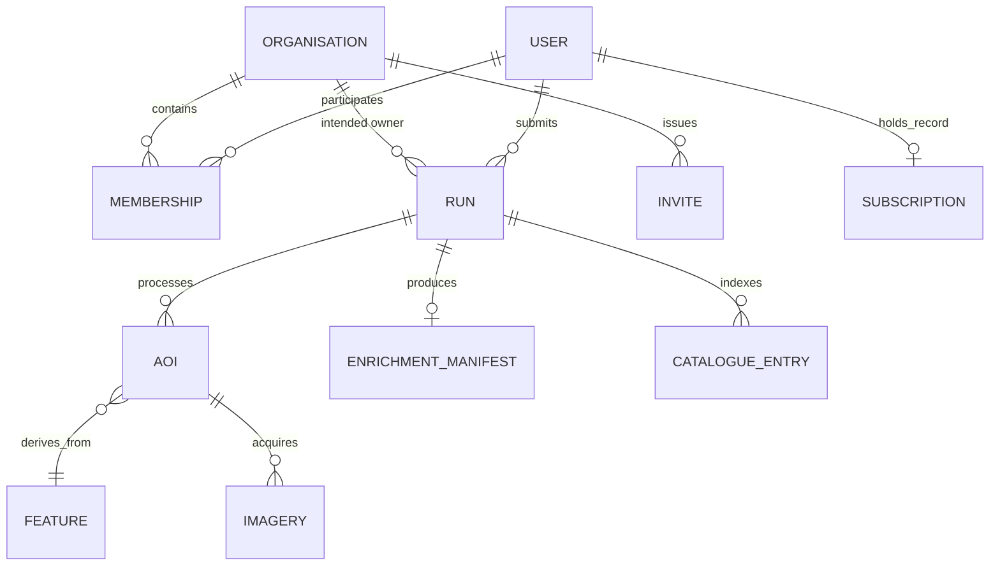

# Canopex Data Model

Canonical domain and persistence reference, reviewed 2026-09-16 against checked-in
code. Intended ownership and current persistence are distinguished below. This
document does not approve a schema migration or certify live infrastructure.

## Domain and Identity

An organisation is the intended ownership and pooled-accounting boundary. Users
submit runs that process one or more AOIs derived from KML/KMZ features. Runs
produce imagery and enrichment evidence; catalogue records support querying that
evidence. Monitors and alerts support repeated observation. Subscription data and
effective entitlements feed organisation accounting; this document does not
replace the billing implementation with a new pricing policy.

```mermaid
erDiagram
    ORGANISATION ||--o{ MEMBERSHIP : contains
    USER ||--o{ MEMBERSHIP : participates
    ORGANISATION ||--o{ RUN : "intended owner"
    USER ||--o{ RUN : submits
    RUN ||--o{ AOI : processes
    AOI }o--|| FEATURE : derives_from
    AOI ||--o{ IMAGERY : acquires
    RUN ||--o| ENRICHMENT_MANIFEST : produces
    RUN ||--o{ CATALOGUE_ENTRY : indexes
    ORGANISATION ||--o{ INVITE : issues
    USER ||--o| SUBSCRIPTION : holds_record
```

The diagram expresses domain relationships, not physical foreign keys. A failed
run may have no manifest; a constructed artifact path does not prove the blob exists.

| Entity | Identity and authoritative implementation |
| --- | --- |
| User | CIAM `tid:oid`, not email; [user records](../treesight/models/records.py) and [users](../treesight/security/users.py) |
| Organisation | `org_id`; embedded members and `usage`; [org service](../treesight/security/orgs.py) |
| Membership | Member identity/role on the org plus current singular `org_id`/`org_role` on the user; not a general M:N join |
| Invite | Separate `orgs` document: `invite:{org_id}:{normalized_email}`, `doc_type=invite`; JWT is a field, not the ID |
| Subscription | User-scoped subscription record; effective entitlement resolution in [billing](../treesight/security/billing.py) |
| Reservation | Org usage entry keyed by `instance_id`, with parcel count and member identity; [accounting](../treesight/billing/accounting.py) |
| Run | API-generated submission ID reused as Durable instance ID and run document ID; [submission](../blueprints/pipeline/submission.py), [history](../blueprints/pipeline/history.py) |
| Feature/AOI | Parsed feature identity and processed geometry; [Feature](../treesight/models/feature.py), [AOI](../treesight/models/aoi.py) |
| Imagery outcome | Search/order/download/post-process identity and state; [imagery](../treesight/models/imagery.py), [outcomes](../treesight/models/outcomes.py) |
| Enrichment manifest | `enrichment-manifest/v2` envelope with indexed per-AOI evidence; [enrichment contract](ENRICHMENT_AOI_MODEL.md) |
| Catalogue entry | Current ID `{run_id}:{aoi_name_slug}`; [model](../treesight/catalogue/models.py), [repository](../treesight/catalogue/repository.py) |

Catalogue names are normalized/truncated for IDs. Distinct display names can
produce the same slug and therefore the same upsert target. Do not treat the
current ID scheme as a proven unique per-AOI key; correction is tracked by #1523.

## Storage Responsibilities

| Store | Authority | Not responsible for |
| --- | --- | --- |
| Cosmos DB for NoSQL | Application records, org accounting, subscriptions, queryable catalogue and feature controls | Raster/source bytes, waking workers, replacing Durable execution history |
| Azure Blob Storage | Uploaded source, tickets, claim-check payloads, manifests and large evidence artifacts | Cross-record transactions or ownership authorization by path alone |
| Durable task hub | Orchestration execution/history, queued work and timers | Product entitlement truth or complete scientific evidence |
| Stripe | External payment/subscription/metering state | Atomic commits with Cosmos and Blob Storage |

Cosmos already exists; no additional database is required to make these contracts
clear. [The transport](../treesight/storage/cosmos.py) uses managed identity unless
`COSMOS_KEY` is configured for the emulator path. `cosmos_available()` checks
whether an endpoint is configured, not connectivity or health. Deployment and
secret-policy verification remain operational checks.

### Provisioned Cosmos Containers

[OpenTofu](../infra/tofu/main.tf) and the
[local initializer](../scripts/cosmos_init/01-create-containers.csh) define these
containers under `COSMOS_DATABASE_NAME`:

| Container | Partition key | Document ID |
| --- | --- | --- |
| `users` | `/user_id` | `user_id` |
| `subscriptions` | `/user_id` | `user_id` or `{user_id}:emulation` |
| `runs` | `/user_id` | API-managed `submission_id` / `instance_id` |
| `catalogue` | `/user_id` | `{run_id}:{aoi_name_slug}` |
| `monitors` | `/user_id` | Generated monitor ID |
| `orgs` | `/org_id` | `org_id` or invite ID |
| `feature_flags` | `/feature_name` | `feature_name` |
| `feature_flag_overrides` | `/user_id` | `user_id` |

Runtime also attempts best-effort `pipeline_stats` writes. That container is not
in the inspected provisioning inventory; do not assume telemetry persistence is
available because the writer returns without raising. Provisioning parity is
tracked by #1529.

Partition keys describe persistence/query routing, not the complete authorization
policy. Some run access is already shared with org members. A future org-partition
migration must preserve access, query behavior, historical records and accounting.

### Query and Failure Behavior

- Cosmos queries without an explicit partition key enable cross-partition queries.
  Query cost and tenant filtering must be reviewed at each caller.
- Run-history writers can fall back to blobs under
  `pipeline-payloads/analysis-submissions/`; history readers remain Cosmos-only
  and may return an empty result on failure. This is not transparent failover (#1531).
- Catalogue persistence has no equivalent blob fallback. Subscription absence
  may select free defaults; storage failures are not interchangeable with absence.
- Invite-token expiration does not delete the invite document. Token validity,
  Cosmos TTL, artifact retention and account erasure are separate controls.
- Pydantic extra-field handling is model-specific. Do not assume every document
  accepts unknown fields or that permissive loading constitutes a migration plan.

## Accounting and Transactions

Organisation `usage` is the pooled-accounting record. Reservations and finalization
are keyed by instance identity. Fields such as `runs_reserved`, `runs_completed`
and `runs_refunded` account for parcel quantities; one orchestration may contain
multiple parcels. Retained EUDR billing fields must not be silently reinterpreted.

Accounting uses an ETag-conditional replacement of one org document, with bounded
conflict retries. It does not atomically commit the run record, catalogue, blob
artifacts and Stripe event together. External metering can precede the conditional
replace; instance-keyed idempotency and retry state matter. See
[accounting tests](../tests/test_billing_accounting.py) for supported failure paths.

`UserRecord` no longer declares the old per-user quota counter. Legacy stored
fields and a compatibility path remain tracked by #1298; org-pooled accounting
landed under #814/#1057. Retained fields are not another approved quota authority.

## Blob and Evidence Contracts

The [API reference](API_INTERFACE_REFERENCE.md#blob-path-conventions) owns the
physical path conventions. There is no universal `analysis/{instance_id}/`
output directory: ingestion, fulfilment and enrichment use their own namespaces.
Follow emitted result/manifest references instead of reconstructing paths.

AOI metadata uses [aoi-metadata-v2.schema.json](schemas/aoi-metadata-v2.schema.json).
Current enrichment writes use
[enrichment-manifest-v2.schema.json](schemas/enrichment-manifest-v2.schema.json)
and [EnrichmentManifestV2](../treesight/models/enrichment_manifest.py), not the
older permissive record class as the canonical producer contract.

Geospatial coordinates and display centers have different representations:
geometry coordinates are longitude/latitude arrays, while center objects use
named `lat`/`lon` properties. Dates, source scene IDs, AOI identity, processing
parameters and human review revisions must remain traceable through evidence.
Missing source coverage and null metrics are not evidence of no deforestation.

## Remaining Design Decisions and Verification

- M:N user/org membership and org-partitioned storage are previous intended
  directions, not implemented general contracts. Confirm scope before migration;
  do not invent active-org selection or allowance sharing across multiple orgs.
- Catalogue collision prevention, telemetry provisioning and history fallback
  visibility are correctness gaps, not requests for another database.
- Open nested evidence blocks remain deliberately flexible; schema changes need
  producer/consumer tests, not another parallel model document.
- Diagnostics must authenticate and authorize run access before leaving local
  development, per the owner decision in the architecture overview.

Focused checks: [records/schema tests](../tests/test_records.py),
[catalogue tests](../tests/test_catalogue.py),
[accounting tests](../tests/test_billing_accounting.py),
[submission/history tests](../tests/test_analysis_submission_endpoints.py).
These are not proof of cross-system atomicity or live Cosmos provisioning.
